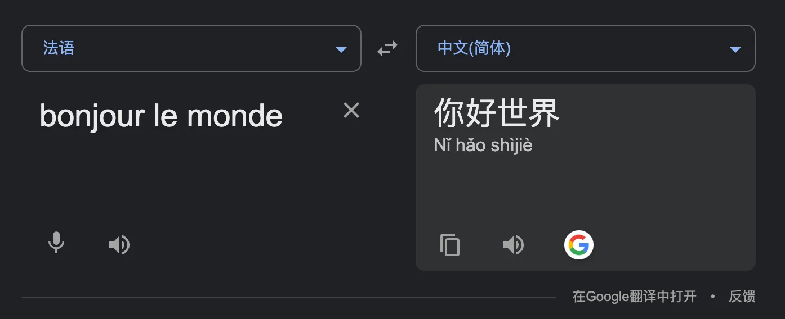
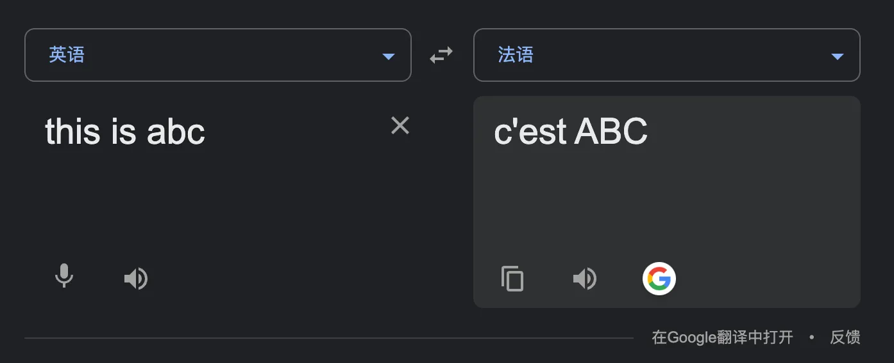
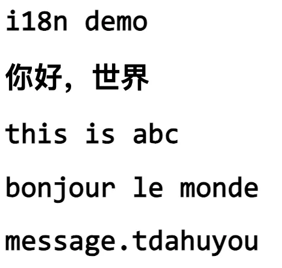

# [0001. i18n 基本使用](https://github.com/Tdahuyou/i18n/tree/main/0001.%20i18n%20%E5%9F%BA%E6%9C%AC%E4%BD%BF%E7%94%A8)

- i18n 基本使用
- 理解 legacy 配置
- 理解 locale 配置
- 理解 fallbackLocale 配置
- 理解 messages 配置
本文介绍了如何将 i18n 加入到 vite 搭建的 vue-ts 工程中，并对其中的一些常见配置项做了简单的介绍。

## 💻 demo - i18n 基本是用

**demo 初始化**

- `pnpm create vite`，跟着提示走，创建一个 vue-ts 项目。
- `pnpm add vue-i18n@9`，安装 vue-i18n，选择 v9 版本。（v9 是当前写文档时的最新版本）

**挂载 i18n 插件**

```ts
// src/main.ts
import { createApp } from 'vue'
import { createI18n } from 'vue-i18n'

import App from './App.vue'

const i18n = createI18n({
  // something vue-i18n options here ...
  legacy: false,
  // 单词 legacy 表示“遗留”的意思
  // 官方对此配置项的描述：
  // The default is to use the Legacy API mode.
  // If you want to use the Composition API mode, you need to set it to false.
  // 翻译翻译：
  // i18n 对旧版本的 vue 的写法做了兼容
  // 如果你的 vue 版本比较旧，或者你想要使用旧版的语法来写，那么不需要配置这个字段，
  // 因为 legacy 的默认值就是 true，这意味着你选择使用遗留的旧版本的写法。
  // 如果你想要使用 Composition API 的新版本语法来写，那么你需要将 legacy 设置为 false。

  locale: 'zh-CN',
  // locale 这个单词可以理解为“当地”的意思
  // 它设置的是当地的默认语言
  // 其实就是我们下面配置的 messages 中的 key 字段
  // 这里设置为 'zh-CN'
  // 意味着我们在使用 i18n 的时候，默认的语言就是 'zh-CN'，它会去读取我们配置的 message 中的内容。

  // fallbackLocale: 'en',
  fallbackLocale: ['en', 'fr'],
  // 设置后备语言为相同的默认语言
  // 它定义了当翻译中缺失某个特定的本地化字符串时，应用应该回退（fallback）到哪个语言环境。
  // 说人话就是，如果 lacale 失效的话，下一个用啥。
  // 它的值可以是字符串，也可以是一个字符串数组。

  // 【示例 1】
  // 比如 locale: 'zh-CN'，fallbackLocale: 'en'
  // 我们在组件中使用 i18n 提供的方法 $t 去翻译 $t('message.abc')
  // 在 'zh-CN' 没有找到对应的翻译，但是在 'en' 找到了对应的翻译，那么就会返回 'en' 对应的翻译。

  // 【示例 2】
  // 同样的道理，如果配置成数组，比如 fallbackLocale: ['en', 'fr']，这意味着如果
  // locale 中没有匹配的翻译项，那么会先找英语 en 然后再找法语 fr。
  // 现在我们使用 $t('message["hello-world"]') 去查找翻译结果，
  // 会发现 'en' 没有对应的翻译，但是 'fr' 有对应的翻译，那么就会返回 'fr' 对应的翻译。

  // 【示例 3】
  // 假如我们要翻译的内容，在 locale 和 fallbackLocale 都没有找到对应的翻译，
  // 那么就会显示参数。
  // 比如 $t('message.tdahuyou')
  // 最终界面会直接将字符串 message.tdahuyou 渲染出来。

  messages: { // 定义各语言的翻译消息
    en: {
      message: {
        hello: 'hello world',
        abc: 'this is abc',
      },
    },
    'zh-CN': {
      message: {
        hello: '你好，世界',
      },
    },
    fr: {
      message: {
        'abc': 'c\'est ABC',
        'hello-world': 'bonjour le monde',
      },
    }
  },
})

const app = createApp(App)

app.use(i18n) // 将 i18n 插件挂载到 Vue 应用上
app.mount('#app')
```

**参考翻译**





**测试**

```vue
<!-- App.vue -->
<script setup lang="ts"></script>

<template>
  <h1>i18n demo</h1>
  <h1>{{ $t('message.hello') }}</h1>
  <h1>{{ $t('message.abc') }}</h1>
  <h1>{{ $t('message["hello-world"]') }}</h1>
  <h1>{{ $t('message.tdahuyou') }}</h1>
</template>
```

最终渲染结果如下图所示。

