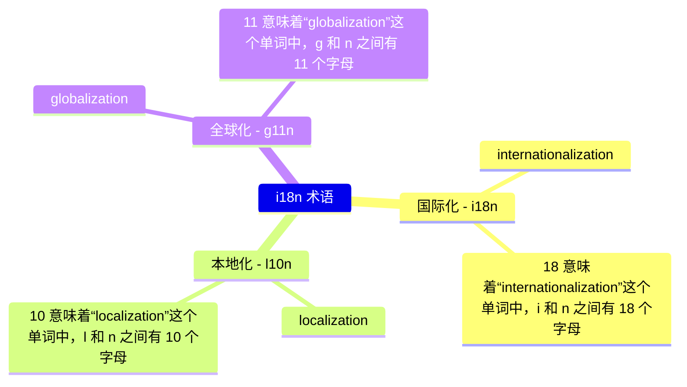

# [0003. 术语](https://github.com/Tdahuyou/i18n/tree/main/0003.%20%E6%9C%AF%E8%AF%AD)

<!-- region:toc -->

<!-- endregion:toc -->

## 📝 summary

- 了解术语 i18n、l10n、g11n

## 💡 mindmap

## 🔗 links

- https://www.w3.org/International/i18n-drafts/nav/about.zh-hans.html
  - W3C 文章 - 关于国际化
- https://www.w3.org/International/questions/qa-i18n
  - W3C 文章 - 本地化与国际化有什么关系？
- https://zh.wikipedia.org/zh-cn/%E5%9B%BD%E9%99%85%E5%8C%96%E4%B8%8E%E6%9C%AC%E5%9C%B0%E5%8C%96
  - wiki - 国际化与本地化